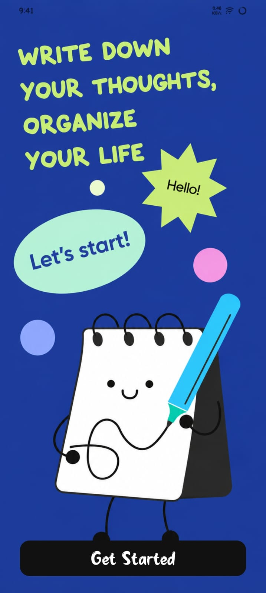
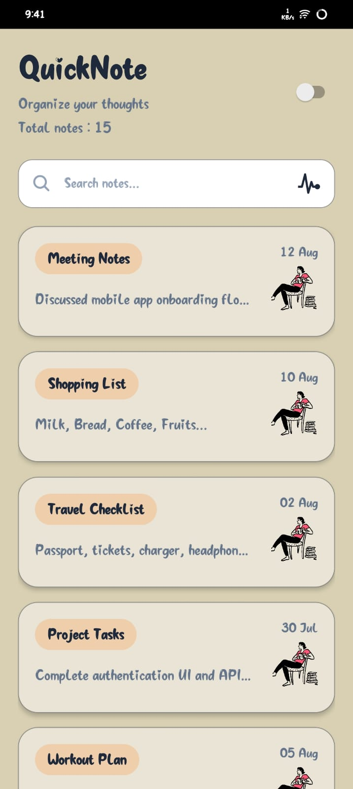
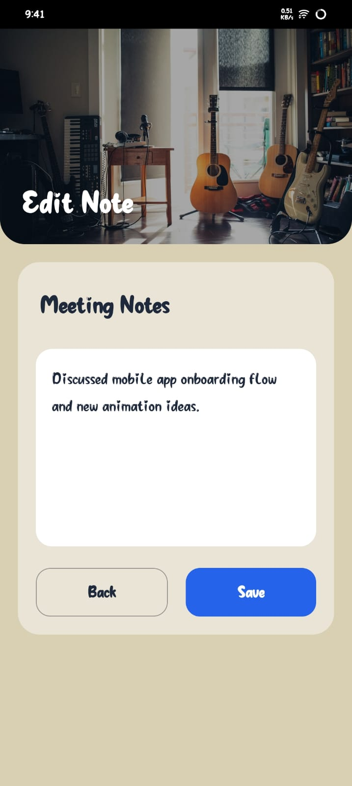
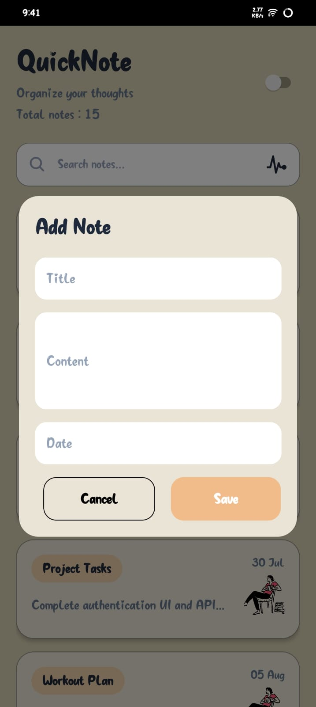
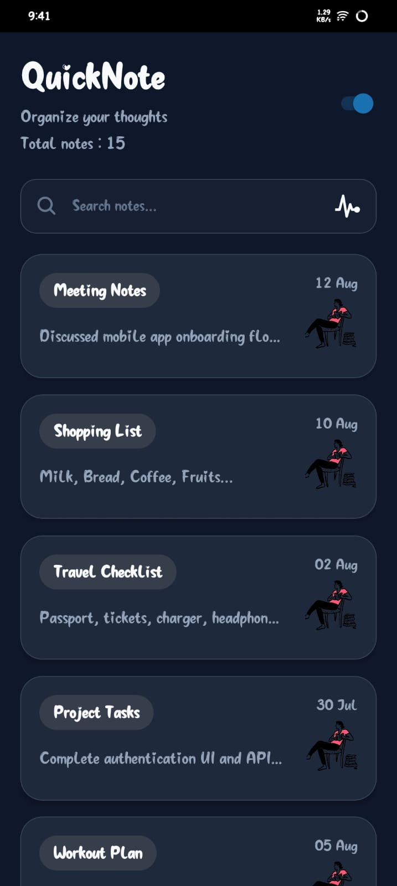

# Welcome to your Quick app 👋

This is an [Expo](https://expo.dev) project created with [`create-expo-app`](https://www.npmjs.com/package/create-expo-app).

## Get started

1. Install dependencies

   ```bash
   npm install
   ```

2. Start the app

   ```bash
   npx expo start
   ```

- This is the main page pop-up when first open or reload app. Press "Get Started" button to close this page.


- This is the home page of app. Here all the cards are displayed using flatlist. tap on the card to open the view/edit screen.
- There is a search bar on top of cards to search card. And right side there is a pusle icon tap it to add new card.


- This is view/edit screen.


- This is a pop-up Modal to add new note.


- This is home page in dark theme.

