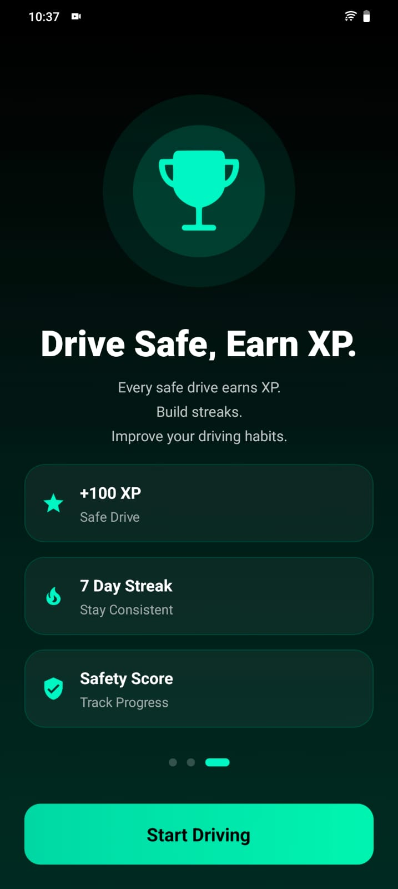
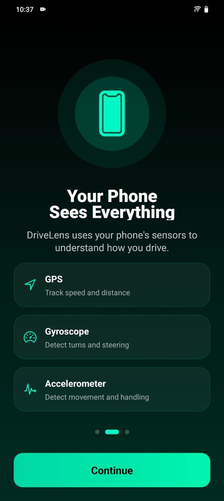
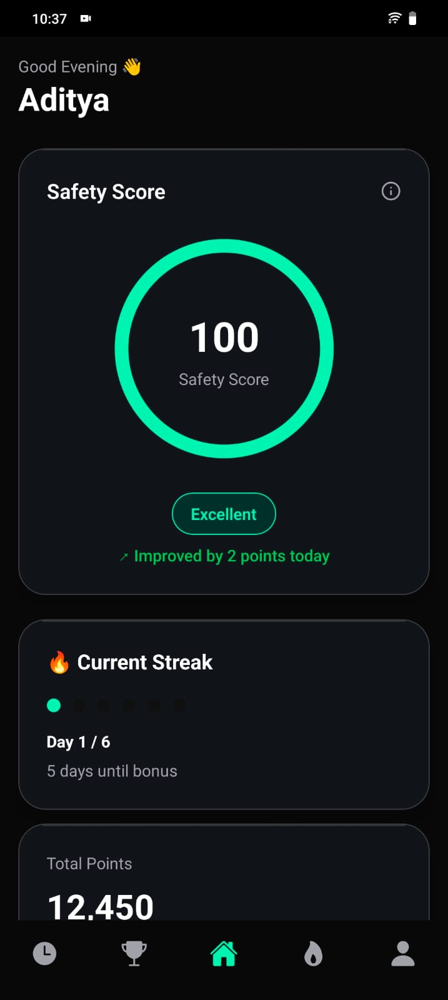
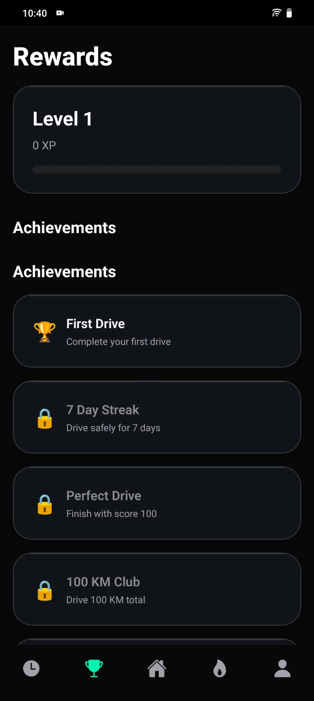
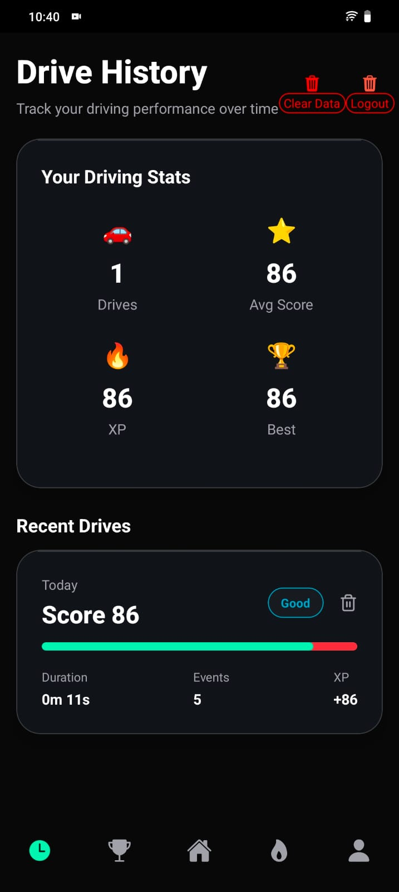
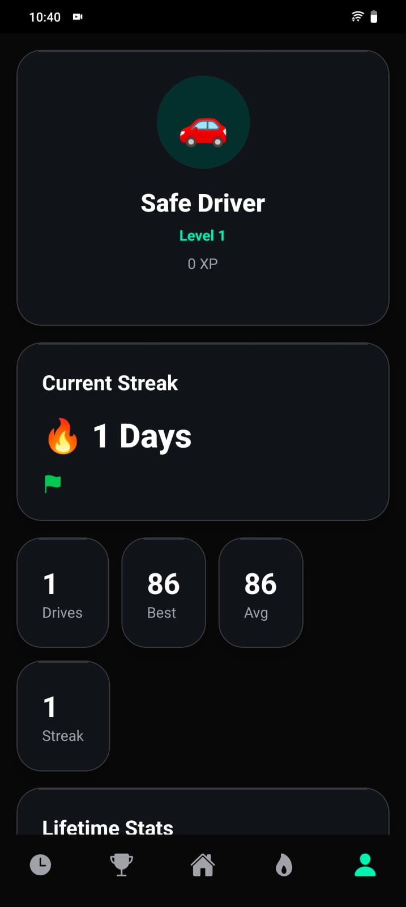
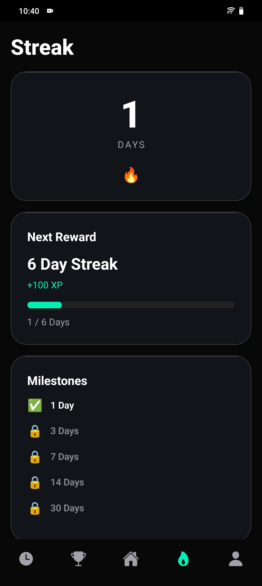

# 🚗 DriveLens

<div align="center">

### Intelligent Driving Analytics Built With Expo Router

Transform raw sensor and GPS data into meaningful driving insights.

Track drives, analyze driving behavior, maintain streaks, earn XP, unlock achievements, and become a safer driver.

</div>

---

# Demo Video 
https://ik.imagekit.io/o6n27bufc/WhatsApp%20Video%202026-06-06%20at%2011.25.56%20PM.mp4

# 📸 Screenshots

## Splash Screen


## Onboarding Screen



## Home Screen 


## Reward Screen


## History Screen 


## Profile Screen


## Streak Screen



---

# 🎯 Problem Statement

Most drivers are unaware of their actual driving habits.

Unsafe behaviors such as:

- Phone handling while driving
- Aggressive steering
- Sharp turns
- Harsh braking
- Frequent distractions

often occur without conscious awareness.

DriveLens solves this problem by combining sensor data and GPS tracking to provide actionable feedback and analytics after every drive.

---

# ✨ Features

## 🚘 Drive Tracking

Track complete driving sessions in real-time.

### Includes

- Live speed tracking
- Distance tracking
- Drive duration
- Event monitoring
- Final safety score

---

## 📍 GPS Tracking

Monitor user location throughout the drive.

### Capabilities

- Real-time speed calculation
- Distance calculation
- Route progression tracking

---

## 📱 Sensor-Based Driving Analysis

DriveLens uses device sensors to understand driving behavior.

### Accelerometer

Used for:

- Device movement detection
- Phone handling detection
- Sudden motion analysis

### Gyroscope

Used for:

- Sharp turn detection
- Aggressive steering detection
- Rotation analysis

---

## 🎯 Safety Score Engine

Every drive begins with:

```text
Score = 100
```

Unsafe events reduce the score.

### Penalty System

| Event | Penalty |
|---------|---------|
| Harsh Brake | -5 |
| Harsh Acceleration | -5 |
| Sharp Turn | -3 |
| Aggressive Steering | -3 |
| Phone Handling | -10 |
| Device Movement | -2 |

---

## 🔥 Streak System

Maintain consistent driving activity.

### Features

- Current streak
- Best streak
- Milestone tracking
- Reward progression

---

## ⭐ XP System

Safe driving earns experience points.

XP contributes toward:

- Level progression
- Achievement unlocks
- Driver ranking

---

## 🏆 Achievement System

Dynamic achievements unlock automatically.

### Examples

- First Drive
- Perfect Drive
- 7 Day Streak
- 100 KM Club
- 1000 XP Earned

---

## 📜 Drive History

Every completed drive is stored locally.

### Stored Information

- Score
- Duration
- Distance
- Events
- Safety rating
- Drive timestamps

---

## 👤 Driver Profile

Comprehensive driver analytics dashboard.

### Statistics

- Total drives
- Total distance
- Average score
- Best score
- XP earned
- Streak progress
- Achievements unlocked

---

# 🏗️ System Architecture

```text
                    GPS
                     │
                     ▼
             Location Tracking
                     │
                     ▼
            Speed & Distance
                     │

Accelerometer ──► Event Engine ◄── Gyroscope
                     │
                     ▼
              Score Calculation
                     │
                     ▼
          XP + Streak Calculation
                     │
                     ▼
        History + Achievements
                     │
                     ▼
            User Analytics
```

---

# 🔄 Application Flow

```text
App Launch
    │
    ▼
Splash Screen
    │
    ▼
Onboarding
    │
    ▼
Permission Setup
    │
    ▼
Dashboard
    │
    ▼
Start Drive
    │
    ▼
Sensor Monitoring
    │
    ▼
Event Detection
    │
    ▼
Score Engine
    │
    ▼
Save Session
    │
    ▼
Update XP
    │
    ▼
Update Streak
    │
    ▼
History & Rewards
```

---

# 📍 GPS Tracking System

## Theory

GPS tracking provides geographical coordinates that are used to calculate speed and distance traveled.

The application continuously listens for location updates and calculates movement between points.

## Why It Matters

Without GPS:

- Speed cannot be calculated
- Distance cannot be tracked
- Trip analytics become impossible

## Flow

```text
GPS Coordinates
        │
        ▼
Location Hook
        │
        ▼
Speed Calculation
        │
        ▼
Distance Calculation
        │
        ▼
Drive Session
```

---

# 📱 Sensor Monitoring System

## Theory

Modern smartphones contain sensors capable of measuring motion and rotation.

DriveLens combines these sensors to identify unsafe driving behavior.

### Accelerometer

Measures:

```text
X Axis Movement
Y Axis Movement
Z Axis Movement
```

### Gyroscope

Measures:

```text
Device Rotation
Angular Velocity
Orientation Changes
```

---

# 📲 Phone Handling Detection

## Theory

Phone handling is one of the most dangerous driving distractions.

The application combines:

```text
Accelerometer Magnitude
+
Gyroscope Rotation
```

to determine whether the phone is being actively manipulated.

## Detection Flow

```text
Accelerometer
      │
      ▼
Magnitude Calculation
      │
      ▼
Threshold Check

Gyroscope
      │
      ▼
Rotation Analysis
      │
      ▼

Phone Handling Event
```

---

# 🌀 Sharp Turn Detection

## Theory

Sharp turns generate sudden rotational movement.

The gyroscope provides rotational velocity which can be used to detect these movements.

## Detection Flow

```text
Gyroscope Rotation
        │
        ▼
Rotation Threshold
        │
        ▼
Sharp Turn Event
```

---

# 🎯 Aggressive Steering Detection

## Theory

Rapid steering corrections generate strong rotational changes.

Although steering wheel data is unavailable, gyroscope rotation acts as a useful approximation.

## Detection Flow

```text
Gyroscope Rotation
        │
        ▼
Steering Threshold
        │
        ▼
Aggressive Steering Event
```

---

# 🎯 Safety Score Engine

## Theory

Every drive begins with a perfect score.

```text
Score = 100
```

Detected events reduce the score.

This provides an easy-to-understand safety metric.

## Flow

```text
Drive Starts
      │
      ▼
Score = 100
      │
      ▼
Events Detected
      │
      ▼
Apply Penalties
      │
      ▼
Final Score
```

---

# 🔥 Streak System

## Theory

Consistency encourages safer driving habits.

The streak system rewards consecutive driving days.

## Rules

```text
Same Day
    │
    ▼
No Change

Next Day
    │
    ▼
+1 Streak

Missed Day
    │
    ▼
Reset Current Streak
```

## Data Stored

```ts
{
  currentStreak: number;
  bestStreak: number;
  lastDriveDate: string;
}
```

---

# ⭐ XP System

## Theory

XP introduces gamification into the driving experience.

Safer drives produce more XP.

## Flow

```text
Drive Completed
      │
      ▼
Final Score
      │
      ▼
XP Awarded
      │
      ▼
Level Progression
```

---

# 🏆 Achievement System

## Theory

Achievements provide long-term goals and motivation.

Unlocks occur automatically based on user activity.

## Available Achievements

```text
🏆 First Drive
🏆 Perfect Drive
🏆 7 Day Streak
🏆 100 KM Club
🏆 1000 XP Earned
```

## Flow

```text
User Activity
      │
      ▼
Achievement Check
      │
      ▼
Unlock Achievement
      │
      ▼
Reward User
```

---

# 📜 Drive History

## Theory

Historical drive data enables users to track improvement over time.

Every completed drive is persisted locally.

## Stored Session Structure

```ts
{
  id: string;
  startedAt: number;
  endedAt: number;
  duration: number;
  distance: number;
  score: number;
  events: DriveEvent[];
}
```

---

# 👤 Profile Analytics

## Theory

The profile dashboard aggregates all historical user data.

### Metrics

- Total Drives
- Total Distance
- Average Score
- Best Score
- XP Earned
- Current Streak
- Achievement Count

---

# 📂 Project Structure

```text
app
├── (tabs)
│   ├── index.tsx
│   ├── history.tsx
│   ├── reward.tsx
│   ├── streak.tsx
│   └── profile.tsx
│
├── drive
│   ├── active.tsx
│   └── summary.tsx
│
├── onboarding
│
└── splash

components
├── cards
├── common
├── buttons
├── navigation
└── branding

hooks
services
storage
store
types
utils
```

---

# 💾 Storage Strategy

## SQLite

Used For:

```text
Drive Sessions
Drive History
Events
```

## AsyncStorage

Used For:

```text
XP
Streak
Achievements
Onboarding State
```

---

# 🛠️ Tech Stack

### Mobile

- React Native
- Expo
- Expo Router

### State Management

- Zustand

### Storage

- SQLite
- AsyncStorage

### Sensors

- Expo Sensors
- Expo Location

### Language

- TypeScript

---

# 📦 Installation

## Clone Repository

```bash
git clone https://github.com/adityau5090/react-native/tree/main/assigments/DriveLens
```

## Navigate To Project

```bash
cd drivelens
```

## Install Dependencies

```bash
npm install
```

or

```bash
yarn
```

---

## Start Development Server

```bash
npx expo start
```

---

## Run Android

```bash
npx expo run:android
```

---

## Run iOS

```bash
npx expo run:ios
```

---

# 🔐 Required Permissions

DriveLens requires:

### Location Permission

Used for:

```text
Speed Tracking
Distance Tracking
Drive Sessions
```

### Motion Sensor Access

Used for:

```text
Phone Handling Detection
Sharp Turn Detection
Aggressive Steering Detection
```

---

# 🚀 Future Roadmap

- Route Maps
- Weekly Analytics
- Driver Levels
- Cloud Synchronization
- Social Challenges
- AI Driving Insights
- Route Replay
- Real-time Driving Feedback
- Leaderboards
- Driving Challenges

---

# 👨‍💻 Author

Built with ❤️ using Expo Router, TypeScript, and React Native.
If you found this project useful, consider giving it a ⭐ on GitHub.