# 🍔 Bite – Food Delivery App

### 🚀 A modern Food Delivery App built with React Native (Expo)

---

## 📌 Overview

Bite is a full-featured **Food Delivery Mobile App UI** inspired by real-world apps.  
It demonstrates **navigation architecture, state management, and clean UI design**.

---

## ✨ Features

- 🔐 Authentication (Login / Logout)
- 🧭 Navigation (Stack, Tabs, Drawer)
- 🍽️ Restaurant listing (dynamic)
- 📦 Category-based filtering
- 🔍 Search functionality
- 🛒 Cart system with quantity control
- 📦 Orders history
- 👤 Profile screen
- 🎨 Premium UI (dark theme, badges)

---

## Tech Stack 

## 🧩 Tech Stack

- ⚛️ **React Native (Expo)**  
  Used to build cross-platform mobile applications using JavaScript and React. Expo simplifies development by providing ready-to-use tools and APIs.

- 🧭 **React Navigation**  
  Handles navigation between screens in the app. Includes Stack, Bottom Tabs, and Drawer navigation for a complete app flow.

- 💾 **AsyncStorage**  
  Used for persistent local storage to store user login state and keep users authenticated even after app reload.

- 🎨 **React Native UI Components**  
  Core components like View, Text, Image, FlatList, and TouchableOpacity used to build responsive and clean UI.

- 🔔 **react-native-toast-message**  
  Used to show feedback messages like "Item added to cart" or "Order placed" in a modern toast style.

- 📦 **Expo Vector Icons**  
  Provides a large set of icons (Ionicons) used in tabs, drawer, and UI elements.

- 📱 **FlatList (React Native)**  
  Efficiently renders large lists like restaurant items and food menus with better performance.

- 🧪 **Custom Components & Reusable UI**  
  Built reusable components for cards, buttons, and layouts to maintain clean and scalable code.

--- 

## ⚙️ Installation

```bash
git clone 
npm install
npx expo start
```

---

## 🧠 Lets's understand the flow of APP 

Onboarding
↓
Login Screen (if not authenticated)
↓
Home Screen (Restaurants)
↓
Restaurant Screen
↓
Cart Screen

---

## Flow Diagram

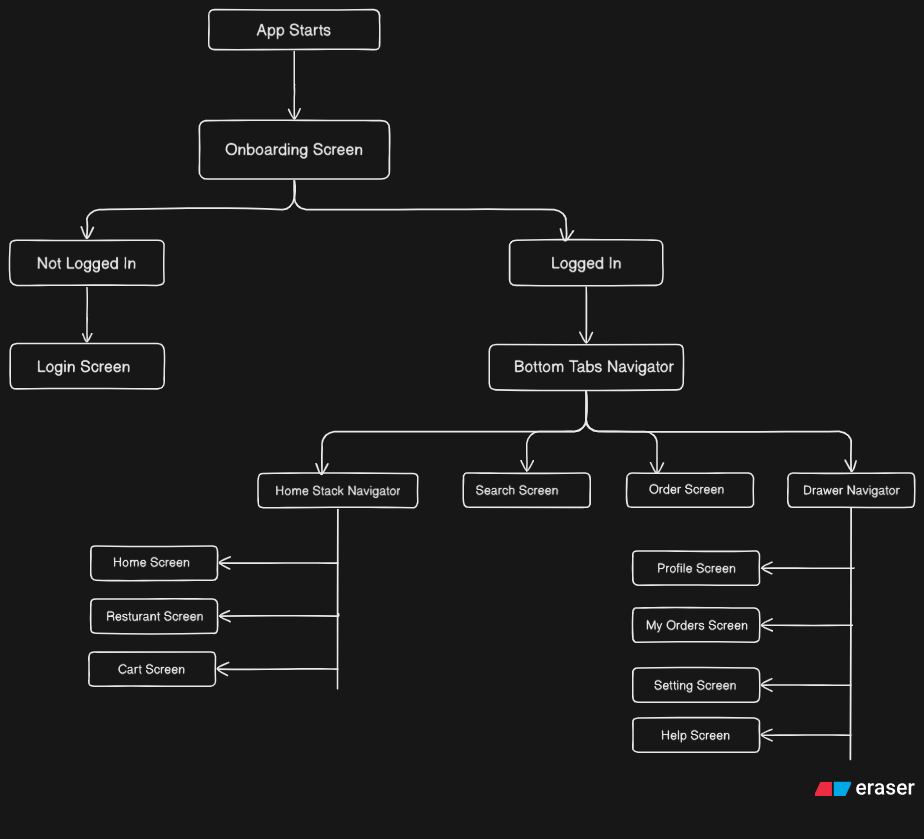

---

## Screenshots

#### Onboarding Screen
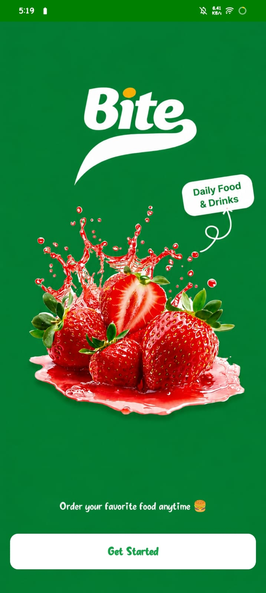

#### Login Screen
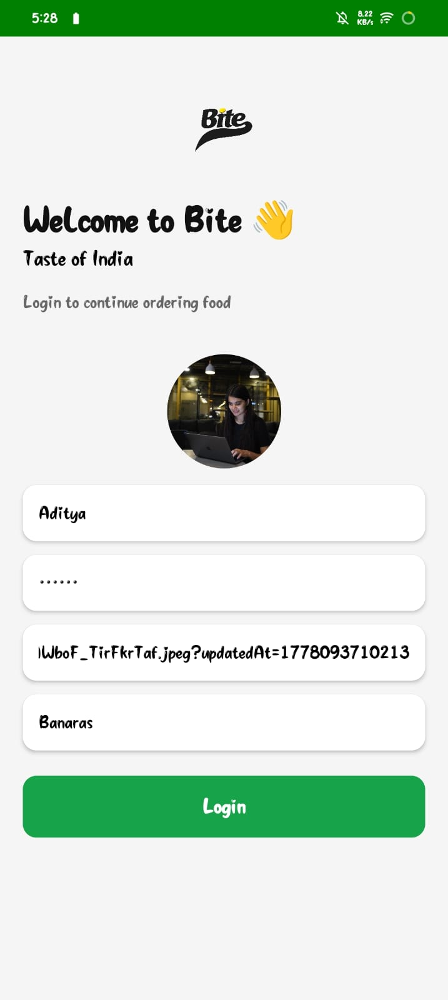

#### Home Screen
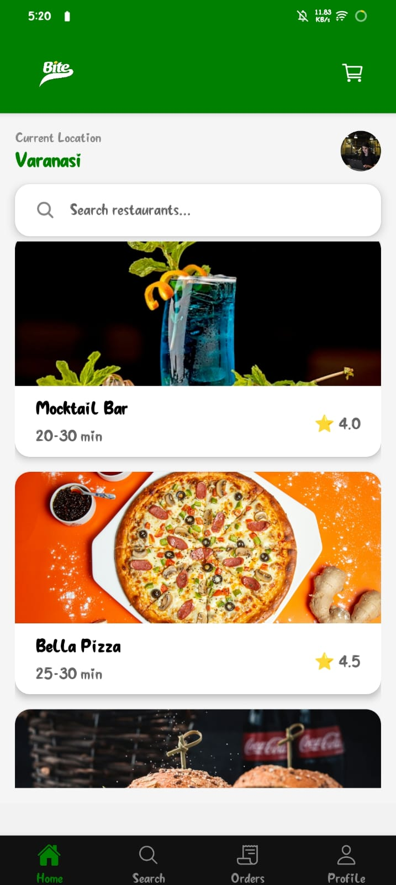
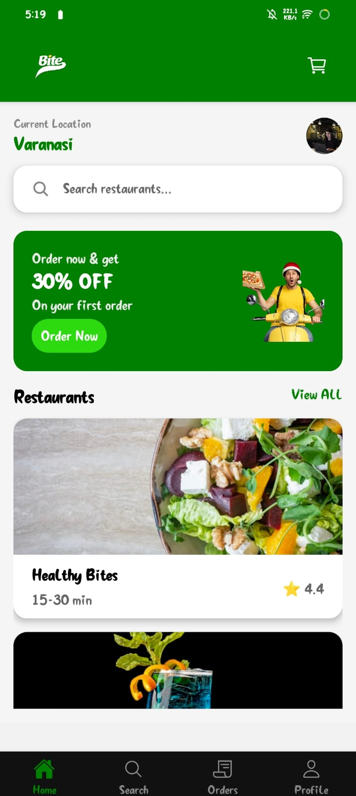

#### Resturant Screen
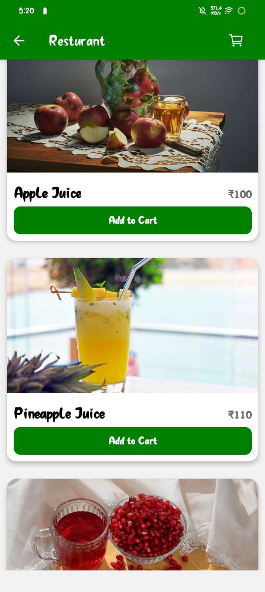

#### Cart Screen
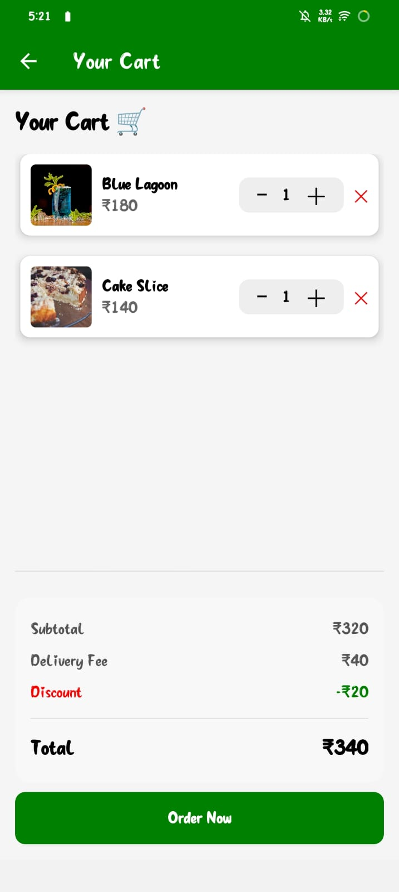

#### Search Screen
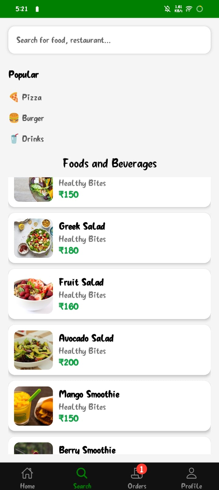

#### Profile Screen
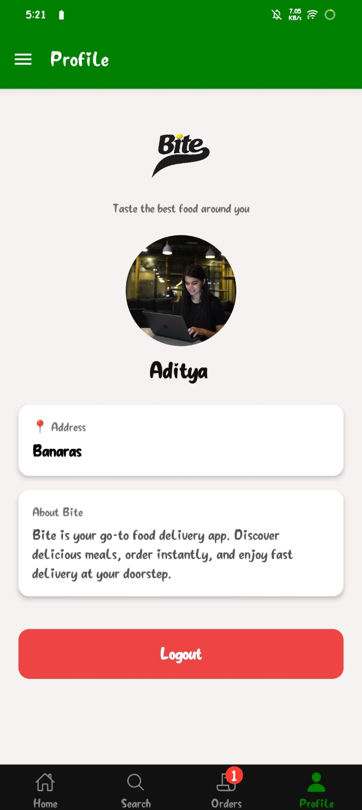

#### Drawer
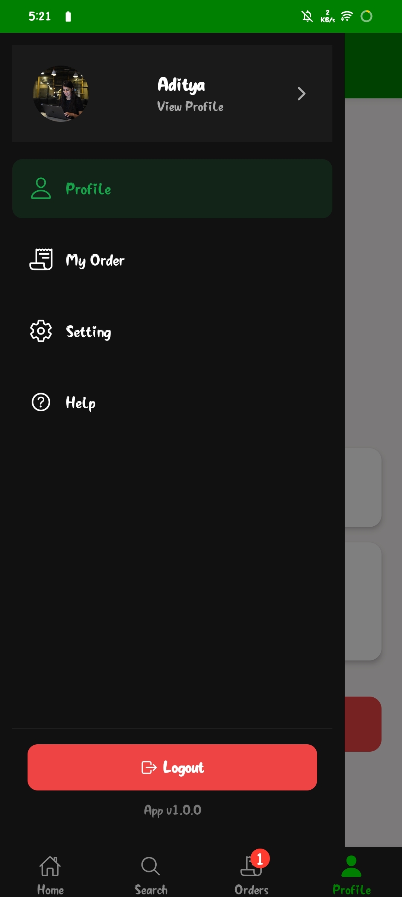

#### Order Badge
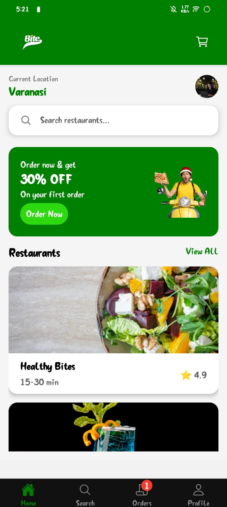

---

## 🧩 Tech Stack

- ⚛️ React Native (Expo)
- 🧭 React Navigation
- 🧠 Context API
- 💾 AsyncStorage
- 🎨 React Native UI

---

## 🔥 Key Concepts Used

### 📍 Navigation
- Stack Navigator
- Bottom Tab Navigator
- Drawer Navigator
- Nested Navigation

---

### 🧠 State Management
- Context API
  - Cart
  - Orders
  - Auth

---

### 🔄 Data Handling
- Single source of truth (`resturantMenu`)
- Shared across:
  - Home
  - Search
  - Restaurant

---

### 🎨 UI/UX Design
- Badge system
- Clean card layouts
- Responsive design

---

## 📸 Screens

- Onboarding Screen
- Login Screen
- Home Screen
- Restaurant Screen
- Cart Screen
- Orders Screen
- Profile Screen
- Help Screen
- Setting Screen

---

## 🎯 Learning Outcomes

- Real-world app architecture
- Navigation patterns
- State management
- UI structuring
- Data consistency

---